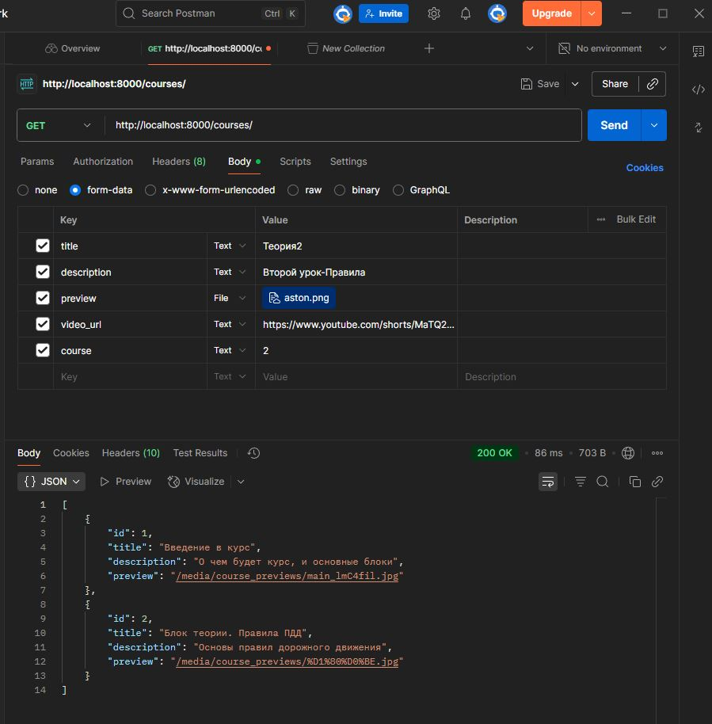
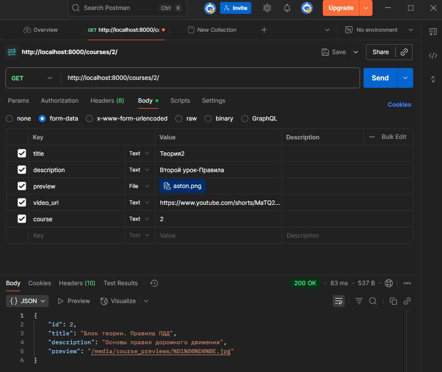
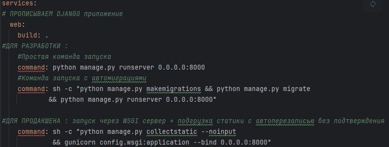
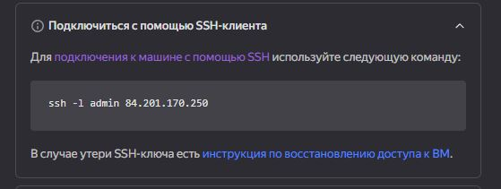
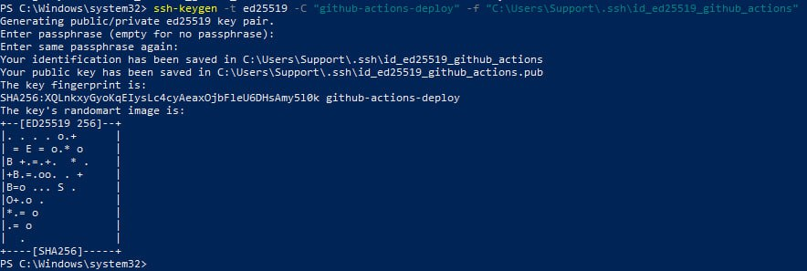
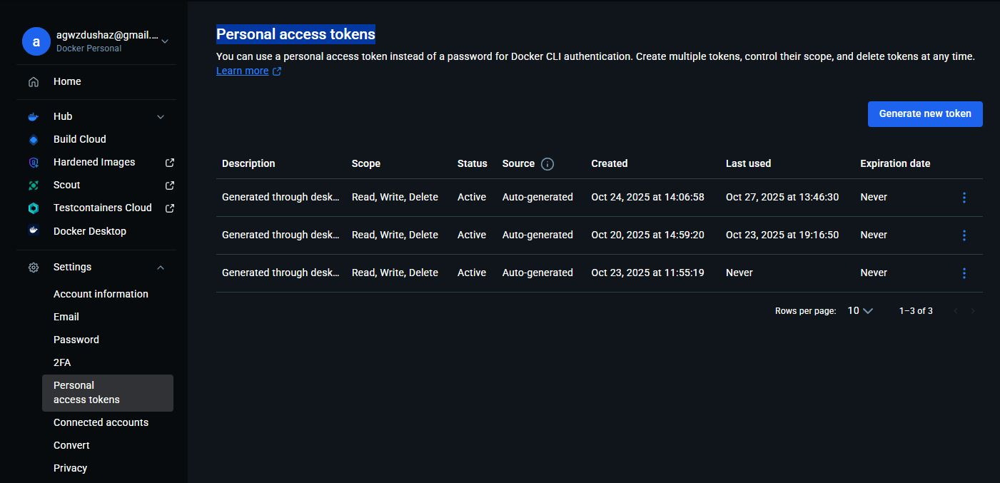

#  DJANGO REST Framework 

# 🔖 Описание проекта:

Данный проект является сервисом передачи данных по API из DJANGO REST FRAMEWORK.

# 🔧 Установка компонентов:


1. Создайте проект и установите poetry:


```pip install --user poetry```


2. Установите инструменты для реализации сервиса:


[]( https://www.djangoproject.com/ )

[](https://django-filter.readthedocs.io/)

[]( https://pypi.org/project/python-dotenv/ )
[]( https://pypi.org/project/psycopg2/ )
[]( https://pypi.org/project/Pillow/ )
[]( https://pypi.org/project/ipython/ )


КОМАНДЫ ДЛЯ ЗАПУСКА ФРЕЙМВОРКА И ПРИЛОЖЕНИЯ
```
poetry add django # Установка django
poetry add djangorestframework # Установка django rest framework
poetry add django-filter # Установка фильтратора DRF
poetry add pillow # Установка библиотеки для работы с изображениями
poetry add dotenv # Установка библиотеки для работы с чувствительными данными
poetry add ipython # Установка библиотеки для работы с чувствительными данными
poetry add psycopg2 # Установка инструмента для работы с ORM

poetry add --dev flake8 mypy isort black # Eстановка всех dev зависимостей 

django-admin startproject config . # Старт нового проекта
django-admin startproject myproject # Старт нового приложения

python manage.py createsuperuser # дать суперпользователя для админки.
При выполнении этой команды необходимо указать имя пользователя и пароль.
Адрес электронной почты является опциональным параметром.

python manage.py shell -i ipython #Запуск DJANGO SHELL

```
🔄 ОБНОВЛЕНИЕ ДАННЫХ

ВНИМАНИЕ!!!
При создании фикстур для моделей использующие AbstractUser или AbstractBaseUser - фикстура создается
с нужными полями так же как из БД КРОМЕ ПОЛЕЙ:

-которые имеют null-true - не обязательно заполнять
-id-pk - не надо
-last_login - категорически нельзя

При записи через фикстуру обычных моделей — указываем все поля, кроме pk/id,
и тех, которые необязательны (null=True, blank=True)

Команда записи фикстуры:

python manage.py loaddata НАЗВАНИЕ_ФИКСТУРЫ.json --ignorenonexistent(игнорирование несуществующих связей)


# ✒️ Использование API
*Get запросы на список*


*Get запросы на конкретный объект*


Для POSTMAN можно выполнять фильтрацию и поиск, если они указаны в полях вьюшки-ендпоинте:
```
http://localhost:8000/users/payment/ - основа
http://localhost:8000/users/payment/?ordering=payment_date=false - сортировка по убыванию(указываем функцию и по какому полю из вьюшки)
http://localhost:8000/users/payment/?payment_method=transfer - фильтрация (можно не указывать поле filterset) 
```


ПРОВЕРКА В DJANGO_SHELL на названия нужных прав:
```
from django.contrib.auth.models import Permission
from django.contrib.contenttypes.models import ContentType

# Найди контент-тип для модели Course
course_ct = ContentType.objects.get(app_label='educations', model='course')
lesson_ct = ContentType.objects.get(app_label='educations', model='lesson')

# Посмотри разрешения
perms = Permission.objects.filter(
    content_type__in=[course_ct, lesson_ct],
    codename__in=[
        'add_course', 'change_course',
        'add_lesson', 'change_lesson'
    ]
)

for p in perms:
    print(p.codename, p.id)
```


```
️ ВАЖНО ⚠️

python manage.py runserver 8080 # Запуск сервера
CTRL+С # Отключение сервера
```

🔝 РАБОТА с CELERY 
*Запуск команд воркера и планера*
```
poetry run celery -A config worker -l INFO -P eventlet
poetry run celery -A config beat -l INFO
poetry run celery -A my_project worker —loglevel=info
poetry run celery -A my_project beat —loglevel=info
```
Далее работа в *setting.py*
```
INSTALLED_APPS = [
    # ... другие приложения ...
    'django_celery_beat',
]
```
💡ВАЖНО💡
ВЫПОЛНИТЕ МИГРАЦИИ ДО РАБОТЫ С ПЛАНЕРОМ + запустите REDIS 
```
poetry run python manage.py migrate
```

### 🌐 Пример страниц:
*Главная страница*


📡 API Документация
API доступно по адресу: http://localhost:8000/api/

Postman коллекция
Для удобства тестирования API предоставлена коллекция Postman:

📥 Скачать Postman Collection

Или импортируйте по ссылке (если опубликовано в Postman Cloud):

🔗 Открыть в Postman

💡 Совет: Импортируйте коллекцию в Postman → "Import" → "Link" или "File". 
### 📶 Работа с запросами
```
http://localhost:8000/users/payment/ - основа
http://localhost:8000/users/payment/?ordering=payment_date=false - сортировка по убыванию(указываем функцию и по какому полю из вьюшки)
http://localhost:8000/users/payment/?payment_method=transfer - фильтрация (можно не указывать поле filterset) 

Регистрация:
http://localhost:8000/users/register/ - post(json-raw)

Вход и получение токена post:
http://localhost:8000/users/login/ в body отправить json (json-raw)

Просмотр профиля get:
http://localhost:8000/users/profile/ (headers) Accept -Bearer  токен 

Редактирование профиля patch:
http://localhost:8000/users/profile/ (json-raw) patch + (headers) Accept -Bearer токен

Редактирование профиля полностью( нужны важные поля входа в аккаунт) put:
http://localhost:8000/users/profile/ (json-raw) patch + (headers) Accept - Bearer токен 

Удаление профиля delete:
http://localhost:8000/users/profile/delete (headers) Bearer  токен 

Просмотр списков пользователя get:
http://localhost:8000/users/list/(headers) Accept - Bearer  токен 

Отправка refresh токена post:
http://localhost:8000/users/list/(headers) Content-Type - application/json/ 
в body отправить json
{"refresh":"токен"} 
```

### 🐳 DOCKER local
ЭТАПЫ ЗАПУСКА КОНТЕЙНЕРОВ(при compose)

1.*Пишем Dockerfile*

2.*Пишем docker-compose.yml*

3.*Выполняем сборку: docker-compose build*

4.*Запускаем: docker-compose up -d*

    ИЛИ
  *Можно унифицировать: docker-compose up -d --build*

- Если образы для сервисов еще не созданы, они будут собраны перед запуском.

Команда для создания образа из докерфайла с присваиванием имени(-t)
(важно что бы poetry lock и toml использовали одну версию пайтона)
```
docker build -t django_rest_hw .
```

Команда просмотра образов
```
docker images
```
Команда просмотра логов

```
docker logs my-django-app
```
Команда просмотра контейнеров и удаления по id 
```
docker ps  
docker stop <контейнер id>
```

Команда остановки контейнера и чистки кэша
```
docker stop my-django-app
docker rm my-django-app
```

Запуск контейнера с параметрами .env как 1 контейнер на фоне(-d)
-указываем имя контейнера(--name)
-порт(-p)
-env-файл (--env-file)
- и имя образа
*(d settings ALLOWED_HOSTS = ['*'] для разработки)*
```
docker run -d --name my-django-app -p 8000:8000 --env-file .env django_rest_hw # для проверки работы django 
docker compose up -d --build # запускает все
```

Команда повторного запуска контейнера
```
docker start my-django-app
```

                        🔍РАБОТА С DOCKER COMPOSE🔎

Сборка образа на фоне(-d)
```
docker-compose up -d --build
```

Остановка всех работающих контейнеров
```
docker-compose down
```

Просмотр логов и id всех контейнеров
```
docker-compose logs
docker-compose ps -a
docker compose ps
```
### 🐳 DOCKER server 🌍
УСТАНОВКА DOCKER НА СЕРВЕР
1. Установка всех библиотек и обновления(оф. документация)
```
# Add Docker's official GPG key:
sudo apt-get update
sudo apt-get install ca-certificates curl
sudo install -m 0755 -d /etc/apt/keyrings
sudo curl -fsSL https://download.docker.com/linux/ubuntu/gpg -o /etc/apt/keyrings/docker.asc
sudo chmod a+r /etc/apt/keyrings/docker.asc

# Add the repository to Apt sources:
echo \
  "deb [arch=$(dpkg --print-architecture) signed-by=/etc/apt/keyrings/docker.asc] https://download.docker.com/linux/ubuntu \
  $(. /etc/os-release && echo "${UBUNTU_CODENAME:-$VERSION_CODENAME}") stable" | \
  sudo tee /etc/apt/sources.list.d/docker.list > /dev/null
sudo apt-get update
```
2. Устанавливаем пакет Docker:
```
sudo apt-get install docker-ce docker-ce-cli containerd.io docker-buildx-plugin docker-compose-plugin
```

3. Добавьте себя в группу docker (чтобы не использовать sudo):
```sudo usermod -aG docker $USER```
ВАЖНО - обязательно выйти из сессии *exit* и авторизоваться заново *ssh testadmin@0.0.0.0*
4. Проверьте установку и проверьте работу:
```
docker --version
docker compose version
docker run hello-world
```

!!! ПРИМЕНЕНИЕ МИГРАЦИЙ НА СЕРВЕРЕ ТОЛЬКО ВРУЧНУЮ !!!
```
1 - ssh your_user@your_server_ip - вход на сервер
2 - cd /path/to/your/django-project/ - переходим в папку с проектом
3 - docker-compose ps - проверка запущеных контейнеров
4 - docker-compose exec web python manage.py migrate --noinput - миграции в терминале
# Важно ставить флаг --noinput  для игнорирования интерактивного ввода подтверждения
```
или через GitHub Actions

ПРИМЕР РАБОТЫ ДЕПЛОЯ ДЛЯ РАЗРАБОТКИ И В ПРОДАКШН:


ПОЛУЧЕНИЕ ПУБЛИЧНОГО SSH ключа через консоль с пк(или ключ в папке /.ssh-.pub)/ для связи моего пк и сервера:
```
cat ~/.ssh/id_ed25519.pub
```

                            📤СВЯЗКА СЕРВЕРА И GITHUB📥
1. Создаем ключ
```ssh-keygen -t ed25519 -C "USEREMAIL"```
2. Привязка ключа к github аккаунту 
3. Проверка связки:
```ssh -T git@github.com```
4. Клонируем репозиторий:
```git clone git@github.com:USERACCOUNT/USER_REPO.git```
5. Переключение на нужную ветку:
```
cd USER_REPO
git checkout feature_35
```
ВАЖНО - при последующем подключенни к ветке *cd ~/USER_REPO* мы остаемся в этой ветке НАВСЕГДА

ТАКЖЕ ВАЖНО при пуше на github - подтяните на сервере изменения(если нет CI/CD):
1. ```cd ~/DJANGO_REST_HW``` *переключаемся на ветку*
2. ```git pull origin feature_35``` подтягиваем изменения
4. Добавляем пользователя в группу docker
```sudo usermod -aG docker streetadmin```
5. ```docker compose down``` *ЕСЛИ КОНТЕЙНЕР БЫЛ ЗАПУЩЕН - ОСТАНАВЛИВАЕМ*
6. ```docker-compose up -d --build``` *пересобираем контейнеры*
ВАЖНО - при использовании *celery_beat* применяйте миграции ВРУЧНУЮ:
```docker compose exec web python manage.py migrate```

7. Создаем на ветке файл env:
```nano .env```
8. После добавления данных сохраняем и выходим: *Ctrl+O → Enter → Ctrl+X*

Проваливаемся в ВМ и подлючаемся:


                        📦ВКЛЮЧЕНИЕ КОНТЕЙНЕРОВ📦
1. Переходим в папку проекта:
```
ls # узнаем имя папки
cd D # D потому что первая буква из названия папки проекта и потом жмем "Tab" и "Enter"

# или

cd ~/DJANGO_REST_HW
```


ЕСЛИ НУЖНО ПОДТЯНУТЬ ИЗМЕНЕНИЯ В ПРОЕКТ:
```git pull origin feature_35```

2. Если *studo* выключен, то используйте:
```docker compose up -d --build```

###      🛠️НАСТРОЙКА ВМ🛠️
Для начала работы убедитесь что папка .ssh создана по пути C:\Users\ВАШ_ПОЛЬЗОВАТЕЛЬ\.ssh

- СОЗДАЕМ Виртуальную Машину(ВМ) с именем админа и сгенерированным ssh + архив скачается на пк(сохраните по пути users/User/.ssh/)


- Далее распаковываем архив с ключом(достать ключи в папку вручную)
- Открываем приватный ключ в powershell
```
Get-Content -Path "C:\Users\ВАШЕИМЯЮЗЕРА\.ssh\ssh2025"
```

Будет примерно такой ключ - скопировать весь и сохранить в txt(для подстраховки)


можно проверить этот ключ для подключения к серверу через *Yandex Cloud Shell*(имя админа + ключ)


!!! ВАЖНО - При переустановке windows желательно забрать всю папку .ssh из системы !!!

-Сгенерируй ключ из приватного и сравни с ключом на ВМ в разделе МЕТАДАННЫЕ:
```ssh-keygen -y -f "$env:USERPROFILE\.ssh\ssh2025"```
	ИТОГ: это твой ключ только для соединеия твоего ПК и твоего СЕРВЕРА

🔥 МОЖНО СДЕЛАТЬ ПРОЩЕ, ЕСЛИ СОЗДАТЬ ПАРУ КЛЮЧЕЙ НА ПК и создать ВМ отдав публичную часть 🔥

1. 🧱 Настрой фаервол (UFW)
```
# Разрешить SSH (обязательно ДО включения!)
sudo ufw allow 22/tcp

# Разрешить веб-трафик
sudo ufw allow 80/tcp
sudo ufw allow 443/tcp

# Включить фаервол
sudo ufw --force enable

# Проверить
sudo ufw status
```

2. 🔄 Обнови систему ВМ(&& - команда "если выполнилась предыдущая - начинай следущую") - если обновил, то пропусти шаг:
```sudo apt update && sudo apt upgrade -y```

или отдельно построчно
```
sudo apt update
#################################################
sudo apt upgrade

# Активация, если inactive:
sudo ufw enable
```
#### 💻 НАСТРОЙКА CI/CD в Github ACTIONS ☁️ 

СОЗДАЕМ КЛЮЧИ ДЛЯ работы ручоного деплоя и CI/CD

❗❗❗РАБОТА НА СВОЕМ ПК В POWERSHELL❗❗❗

☁️СОЗДАНИЕ КЛЮЧА ДЛЯ Github Actions
1. 🔐 Создаем пары ключей с названием *github-actions-deploy* для Github Action (просто жмем везде enter или y)
через полный путь или переменную:
```
ssh-keygen -t ed25519 -C "github-actions-deploy" -f "C:\Users\ВАШЕ_ИМЯ_ПОЛЬЗОВАТЕЛЯ\.ssh\id_ed25519_github_actions"
#####################################################################################################################
ssh-keygen -t ed25519 -C "github-actions-deploy" -f "$env:USERPROFILE\.ssh\id_ed25519_github_actions"
```
Получаем в случае успеха:


2. 📄 Копируем приватный ключ *id_ed25519_github_actions* - он пойдет в проект в раздел Github Secrets:
```type ~/.ssh/id_ed25519_github_actions```
✅ Скопируй ВЕСЬ этот текст — он понадобится как значение для секрета SSH_KEY в GitHub.

3. 🔑 Скопируй публичный ключ — он пойдёт на сервер твоей ВМ:
```type ~/.ssh/id_ed25519_github_actions.pub```

💾СОЗДАНИЕ КЛЮЧА ДЛЯ Github репозитория (для ручного деплоя)⚠️Этот пункт можно выполнить на сервере и скопировать публичный для репозитория⚠️
1. 🔐 Создаем пары ключей с названием *deploy_github* для Github репозитория (просто жмем везде enter или y)
через полный путь или переменную
```
ssh-keygen -t ed25519 -C "deploy_github" -f "C:\Users\ВАШЕ_ИМЯ_ПОЛЬЗОВАТЕЛЯ\.ssh\id_ed25519_deploy_github"
#####################################################################################################################
ssh-keygen -t ed25519 -C "deploy_github" -f "$env:USERPROFILE\.ssh\id_ed25519_deploy_github"
```

2. 📄 Копируем приватный ключ *id_ed25519_deploy_github* - он пойдет в проект в раздел Github Secrets:
```type ~/.ssh/id_ed25519_deploy_github```
✅ Скопируй ВЕСЬ этот текст — он понадобится для твоего сервера

3. 🔑 Скопируй публичный ключ — он пойдёт в раздел SSH ключей твоего репозитория:
```type ~/.ssh/id_ed25519_deploy_github.pub```

🔎ОПЦИОНАЛЬНО: 
 Убедись в корректности Git-настроек (опционально)
```
git config --global user.name
git config --global user.email
```
→ Убедись, что email совпадает с тем, что в ключах.

❗❗❗РАБОТА НА СВОЕМ ПК В POWERSHELL - ПОДКЛЮЧЕНИЕ К ВМ❗❗❗
1. 🔓Подключаемся к своей ВМ(явно указываем приватный ключ или не указываем работаем через Cloud Shell):
```
# Если создал пару ключей на пк и отдал ВМ публичный
ssh -i "C:\Users\Support\.ssh\ssh2025" test@158.160.27.139

# Если создал пару ключей на YC, скачал и распаковал ключи на пк
ssh -i "C:\Users\Support\.ssh\ssh2025" test@158.160.27.139
```

🌟ИЛИ СДЕЛАТЬ SSH-конфиг (гибкий и профессиональный):
В PowerShell выполни

Шаг 1: Создай файл config
```
notepad "$env:USERPROFILE\.ssh\config"
```
Если Notepad спросит — создать файл — нажми Да.


Шаг 2: Вставь настройки
```
Host yandex-vm
    HostName 158.160.27.139
    User test
    IdentityFile ~/.ssh/ssh2025
    IdentitiesOnly yes
```
💡 HostName 158.160.27.139 - ip твоего хоста+
💡 User test - test это имя админа на серваке
💡 yandex-vm — это псевдоним, который ты сам придумал. Можно назвать как угодно. 

Шаг 3: Сохрани и установи права (важно!)
Закрой Notepad. Затем в PowerShell:
```
# Установи правильные права на config
icacls "$env:USERPROFILE\.ssh\config" /inheritance:r
icacls "$env:USERPROFILE\.ssh\config" /grant:r "$env:USERNAME:(R)"
```
Шаг 4: Подключайся!
```
ssh yandex-vm
```
Или, если хочешь по IP — добавь ещё один блок в config:

```
Host 158.160.27.139
    User test
    IdentityFile ~/.ssh/ssh2025
    IdentitiesOnly yes
```

После этого заработает и:
```
ssh test@158.160.27.139
```

2. 🔄 Обнови систему ВМ(&& - команда "если выполнилась предыдущая - начинай следущую") - если обновил, то пропусти шаг:
```sudo apt update && sudo apt upgrade -y```

или отдельно построчно
```
sudo apt update
#################################################
sudo apt upgrade
```

3. 🤔 Узнаем имя админа и путь папки копирования на сервер(DEPLOY_DIR будет в Github Secret):
```
whoami
echo $HOME
 
```

4. 🧠 Создай постоянного пользователя например, admin
```
export USERNAME=admin

#Создаем нового юзера и добавляем в группу studo 
sudo adduser --gecos "" --disabled-password "$USERNAME"
sudo usermod -aG sudo "$USERNAME"

# Надёжное создание .ssh
sudo mkdir -p /home/"$USERNAME"/.ssh
sudo chown "$USERNAME":"$USERNAME" /home/"$USERNAME"/.ssh
sudo chmod 700 /home/"$USERNAME"/.ssh

# Добавление ключа
echo "ssh-ed25519 AAAAC3NzaC1lZDI1NTE5AAAAI... github-actions-deploy" | sudo tee /home/"$USERNAME"/.ssh/authorized_keys > /dev/null
sudo chown "$USERNAME":"$USERNAME" /home/"$USERNAME"/.ssh/authorized_keys
sudo chmod 600 /home/"$USERNAME"/.ssh/authorized_keys

# Права на домашнюю папку (обязательно!)
sudo chmod 755 /home/"$USERNAME"
```

✅ Теперь у тебя есть пользователь с правами sudo.

🧩 Или используем готового админа
```
# 1. Убедитесь, что вы test
whoami  # должно быть: test

# 2. Создайте .ssh (если нет)
mkdir -p ~/.ssh

# 3. Добавьте ключ (пример)
echo "ssh-ed25519 AAAAC3NzaC1lZDI1NTE5AAAAI... github-actions-deploy" >> ~/.ssh/authorized_keys

# 4. Права
chmod 700 ~/.ssh
chmod 600 ~/.ssh/authorized_keys
```
🔒 ВАЖНО - Без этих прав SSH откажет в подключении, даже если ключ верный! 🔒 

6. ✏️ Возмем приватный длиный ключ для ручного деплоя *id_ed25519_deploy_github* и выполни команду:
```
# Создать файл приватного ключа
sudo -u $USERNAME nano /home/$USERNAME/.ssh/id_ed25519_deploy_github
```
Копируем приватный ключ в открытой панели и сохраняем *Ctrl+O > Enter > Ctrl+X*
при повторном вводе команды, должен открытся заполненный файл

7.🤖 Установи права:
```
sudo chmod 600 /home/$USERNAME/.ssh/id_ed25519_deploy_github
sudo chown $USERNAME:$USERNAME /home/$USERNAME/.ssh/id_ed25519_deploy_github
```

8. 🧷 Создай SSH-конфиг для GitHub:
```
sudo -u $USERNAME tee /home/$USERNAME/.ssh/config > /dev/null <<EOF
Host github.com
  HostName github.com
  User git
  IdentityFile ~/.ssh/id_ed25519_deploy_github
  IdentitiesOnly yes
EOF

sudo chmod 600 /home/$USERNAME/.ssh/config
sudo chown $USERNAME:$USERNAME /home/$USERNAME/.ssh/config
```

Можно прочитать его на корректность заполнения
```cat /home/$USERNAME/.ssh/config```
 Получится так:


9. 📝 Добавляем публичный ключ *deploy_github* на Github репозиторий в настройках SSH ключей и выполняем:
```sudo -u $USERNAME ssh -T git@github.com```

При успешном выполнении будет приветствие


10.🔌 Настройка Secrets(информацию достанешь в консоли )
Создай:
```
#SSH_KEY = содержимое приватного ключа Ключа №1 (id_ed25519_github_actions)
#SSH_USER 
whoami 

#SECRET_IP
hostname -I

#DEPLOY_DIR 
echo $HOME

#SSH_KNOW_HOST - отпечаток сервера
ssh-keyscan -t ed25519 ваш_шз_сервера

#ip вашего сервера
SERVER_IP

DOCKER_USERNAME(ваш юзернейм на dockerhub)
DOCKER_PASSWORD(подготовить ваш access token)
```
SSH_KNOW_HOST увидите вывод:

скопируй все без строк хэштега и добавь в secrets SSH_KNOWN_HOST

1. В dockerhub в настройках профиля ищем *Account settings*:


2.Ищем строку *Personal access tokens*


3. Выбираем *generate new token*

4. Скопируйте токен (ОН ДОСТУПЕН ОДИН РАЗ)
5. Добавьте в Github secrets


🧪ДЛЯ УСПЕШНОГО ДЕПЛОЯ ПО SSH(если не настроили установку в коде)🧪
Вам необходим *pip3* и *poetry* на сервере:
```
# Обновить систему
sudo apt update

# Установить pip3
sudo apt install -y python3-pip

# Установить Poetry (официальный способ)
curl -sSL https://install.python-poetry.org | python3 -

#Poetry установится в ~/.local/bin/poetry, поэтому добавьте его в PATH
echo 'export PATH="$HOME/.local/bin:$PATH"' >> ~/.bashrc
source ~/.bashrc

#Проверьте
poetry --version
```


НАСТРОЙКА В ПРОЕКТЕ
1. Создаем путь и файл в корне *.github/workflows/ci.yml*
ВАЖНО ДЛЯ ТЕСТОВ ИСПОЛЬЗОВАНИЕ ОТДЕЛЬНОЙ СУБД в Settings (если в проекте используется postgres):
```
# Настройки для тестирования, включая CI/CD
if "test" in sys.argv:
    ALLOWED_HOSTS = ["testserver", "localhost", "127.0.0.1"]

    # Дополнительные настройки для тестов
    PASSWORD_HASHERS = [
        "django.contrib.auth.hashers.MD5PasswordHasher",  # Быстрее для тестов
    ]

    # 🗃️ База данных - для тестов стоковая
    DATABASES = {
        "default": {
            "ENGINE": "django.db.backends.sqlite3",
            "NAME": BASE_DIR / "db.sqlite3",
        }
    }

    LANGUAGE_CODE = "ru-ru"
    TIME_ZONE = "UTC"
    USE_I18N = True
    USE_TZ = True

    # 📦 Статика
    STATIC_URL = "/static/"
    STATICFILES_DIRS = []

    # 📧 Email
    EMAIL_BACKEND = "django.core.mail.backends.locmem.EmailBackend"

    # ПРОИЗВОЛЬНЫЙ КЛЮЧ ДЛЯ ТЕСТОВ
    SECRET_KEY = "ci-test-secret-key-unsafe-but-ok"
    DEBUG = True
    ROOT_URLCONF = "config.urls"

    # 🔑 Указываем, что кастомная модель User — основная
    AUTH_USER_MODEL = "users.User"

    # 🖼️ TEMPLATES — обязательно для админки
    TEMPLATES = [
        {
            "BACKEND": "django.template.backends.django.DjangoTemplates",
            "DIRS": [],
            "APP_DIRS": True,
            "OPTIONS": {
                "context_processors": [
                    "django.template.context_processors.debug",
                    "django.template.context_processors.request",
                    "django.contrib.auth.context_processors.auth",
                    "django.contrib.messages.context_processors.messages",
                ],
            },
        },
    ]
```
2. При пуше подтверждаем пуш workflows:
```
git add .
git commit -m "Test CI"
git remote set-url origin git@github.com:StreetShiffter/DJANGO_REST_HW.git
git push
```


📄 Лицензия
Этот проект лицензирован по MIT License — подробнее см. файл LICENSE.
